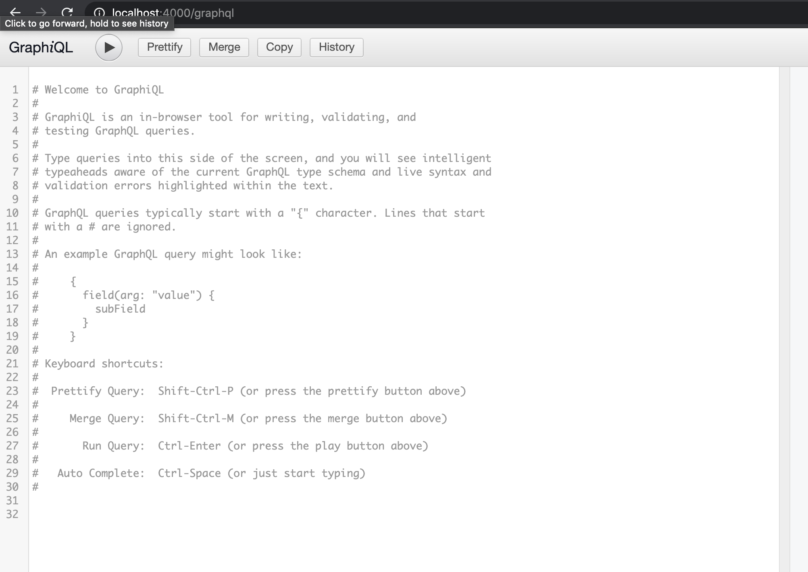

## GraphQL Exercise with the JSONPlaceholder API

### To Run:

Go to [deployed Heroku app](https://charter-graphql-challenge.herokuapp.com/graphql) 

...OR, to run locally:

`npm install` then

`npm run dev:server`

In your browser, go to 

http://localhost:4000/graphql

Clear out the welcome text, begin making queries/mutations in the left window, and press the play button to execute the query or mutation. 



Some examples:

### Queries

_Get a user and return their name and username_

```js
{
    user(id:1){
        name,
        username
    }
}
```
_Get a post and return its title and body_

```js
{
    post(id:122){
        title,
        body
    }
}
```
_Get a comment and return its body (Note: each comment has its own id regardless of the postId it's associated with)_

```js
{
    comment(id:122){
        body
    }
}
```
_Get all comments from a post (identified by postId) and return each comment's body_

```js
{
    comments(postId:2){
        body
    }
}
```

### Mutations

_Update a post's title and return the post's title and body_

```js
mutation{
    updatePost(id:2, title: "New Title Here"){
        title,
        body
    }
}
```

_Delete a post by id (body will return null, which is expected)_

```js
mutation{
    deletePost(id:2){
        body
    }
}
```
